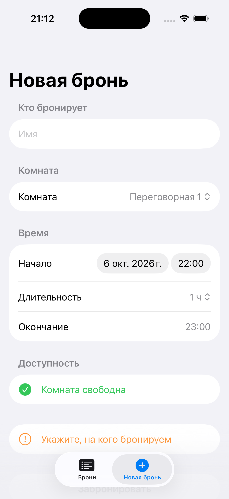

# WORK BOOKING — iOS

iOS-клиент (SwiftUI) для системы бронирования переговорных комнат. Приложение работает поверх REST API из репозитория [wmeenw/work-booking](https://github.com/wmeenw/work-booking) и повторяет его бизнес-правила.



## Требования

- Xcode 16+ (Swift 5, SDK iOS 17+)
- Бэкенд из [wmeenw/work-booking](https://github.com/wmeenw/work-booking) (Java 17+, Maven)

## Запуск

1. Поднимите бэкенд:
   ```bash
   git clone https://github.com/wmeenw/work-booking.git
   cd work-booking
   mvn clean spring-boot:run
   ```
   Сервер стартует на `http://localhost:8080`.

2. Откройте `Package.swift` в Xcode и нажмите ▶ (схема `WorkBooking`).

3. В приложении откройте ⚙︎ → **Адрес сервера**.
   - Симулятор: `http://localhost:8080` (по умолчанию).
   - Реальное устройство: `http://<IP вашего компьютера>:8080` в той же Wi-Fi сети.

## Возможности

| Экран | Что делает | Эндпоинт бэкенда |
|-------|-----------|------------------|
| Брони | Список по дням, свайп для отмены с подтверждением | `GET /api/bookings`, `DELETE /api/bookings/{id}` |
| Новая бронь | Выбор комнаты, времени, длительности и имени | `POST /api/bookings` |
| Новая бронь | Живая проверка «свободна / занята» при выборе времени | `GET /api/rooms/{roomId}/availability` |
| Настройки | Адрес сервера и проверка соединения | `GET /api/bookings` |

## Бизнес-правила

Совпадают с `BookingServiceImpl` бэкенда:

- длительность от 15 до 240 минут;
- начало строго в будущем;
- пересечения с другими бронями в той же комнате запрещены.

Приложение проверяет правила до отправки запроса (`BookingRules.swift`), чтобы показать ошибку сразу. Окончательное решение остаётся за сервером: его ответы 400 и 409 показываются пользователю как есть.

## Структура

```
Sources/WorkBooking/
├── WorkBookingApp.swift     точка входа, таб-бар
├── BookingsListView.swift   список броней
├── NewBookingView.swift     форма новой брони
├── SettingsView.swift       адрес сервера и проверка соединения
├── BookingStore.swift       состояние (@Observable) и адрес сервера
├── BookingAPI.swift         клиент REST API, разбор ошибок
├── BookingRules.swift       бизнес-правила
├── Models.swift             Room, Booking, BookingRequest, AvailabilityResponse
├── Extensions.swift         String.trimmed, WireDate (формат LocalDateTime)
└── AdditionalInfo.plist     разрешение HTTP для локальной сети (ATS)
```

## Важные детали

- Бэкенд передаёт `LocalDateTime` без часового пояса (`2026-09-10T10:00:00`). Клиент работает в локальной зоне телефона, поэтому время, выбранное пользователем, уходит на сервер без пересчёта.
- В бэкенде нет эндпоинта со списком комнат. Список задан в `Models.swift` (`room-1` … `room-4`). Замените его на свои `roomId`, если они другие.
- Бэкенд хранит данные в памяти (H2 in-memory): после перезапуска сервера брони пропадают.
